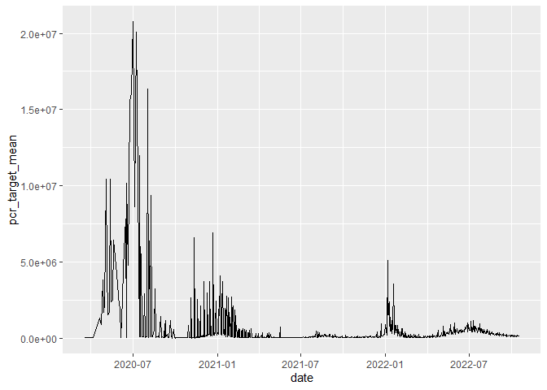
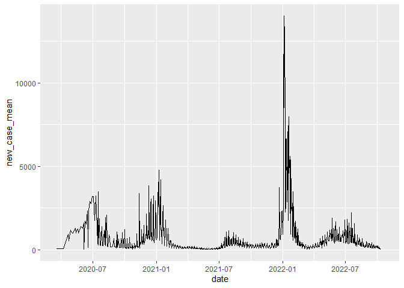

midterm project_appendix
================
chen wei
2022-10-23

## R Markdown

``` r
library(lubridate)
```

    ## 
    ## 载入程辑包：'lubridate'

    ## The following objects are masked from 'package:base':
    ## 
    ##     date, intersect, setdiff, union

``` r
library(usmap)
library(dplyr)
```

    ## 
    ## 载入程辑包：'dplyr'

    ## The following objects are masked from 'package:stats':
    ## 
    ##     filter, lag

    ## The following objects are masked from 'package:base':
    ## 
    ##     intersect, setdiff, setequal, union

``` r
library(tidyverse)
```

    ## ── Attaching packages
    ## ───────────────────────────────────────
    ## tidyverse 1.3.2 ──

    ## ✔ ggplot2 3.3.6     ✔ purrr   0.3.4
    ## ✔ tibble  3.1.8     ✔ stringr 1.4.1
    ## ✔ tidyr   1.2.0     ✔ forcats 0.5.2
    ## ✔ readr   2.1.2     
    ## ── Conflicts ────────────────────────────────────────── tidyverse_conflicts() ──
    ## ✖ lubridate::as.difftime() masks base::as.difftime()
    ## ✖ lubridate::date()        masks base::date()
    ## ✖ dplyr::filter()          masks stats::filter()
    ## ✖ lubridate::intersect()   masks base::intersect()
    ## ✖ dplyr::lag()             masks stats::lag()
    ## ✖ lubridate::setdiff()     masks base::setdiff()
    ## ✖ lubridate::union()       masks base::union()

``` r
library(data.table)
```

    ## 
    ## 载入程辑包：'data.table'
    ## 
    ## The following object is masked from 'package:purrr':
    ## 
    ##     transpose
    ## 
    ## The following objects are masked from 'package:dplyr':
    ## 
    ##     between, first, last
    ## 
    ## The following objects are masked from 'package:lubridate':
    ## 
    ##     hour, isoweek, mday, minute, month, quarter, second, wday, week,
    ##     yday, year

``` r
library(dbplyr)
```

    ## 
    ## 载入程辑包：'dbplyr'
    ## 
    ## The following objects are masked from 'package:dplyr':
    ## 
    ##     ident, sql

``` r
library(ggplot2)
library(webshot)
```

## Data Wrangling

# STEP 0.Read in the data

First download and then read in with data.

``` r
case <- data.table::fread("Statewide COVID-19 Cases Deaths Tests.csv")
waterwaste <- data.table::fread("master-covid-public.csv")
waterwaste<-select(waterwaste, epaid,wwtp_name,reporting_jurisdiction,county_names
,test_result_date,pcr_target_avg_conc,Sample_Location_Longitude,Sample_Location_Latitude)
```

``` r
#switch the FIPS code in waterwaste data to county name for a easier identification and further expolore
waterwaste$county_names[waterwaste$county_names=="06067"]<-"Sacramento"
waterwaste$county_names[waterwaste$county_names=="06001, 06013"]<-"Alameda"
waterwaste$county_names[waterwaste$county_names=="06063"]<-"Plumas"
waterwaste$county_names[waterwaste$county_names=="06029"]<-"Kern"
waterwaste$county_names[waterwaste$county_names=="06025"]<-"Imperial"
waterwaste$county_names[waterwaste$county_names=="06013"]<-"Contra Costa"
waterwaste$county_names[waterwaste$county_names=="06019"]<-"Fresno"
waterwaste$county_names[waterwaste$county_names=="06037"]<-"Los Angeles"
waterwaste$county_names[waterwaste$county_names=="06037, 06111"]<-"Los Angeles"
waterwaste$county_names[waterwaste$county_names=="06033"]<-"Lake"
waterwaste$county_names[waterwaste$county_names=="06059"]<-"Orange"
waterwaste$county_names[waterwaste$county_names=="06071"]<-"San Bernardino"
waterwaste$county_names[waterwaste$county_names=="06073"]<-"San Diego"
waterwaste$county_names[waterwaste$county_names=="06075, 06081"]<-"San Francisco"
waterwaste$county_names[waterwaste$county_names=="06099"]<-"Stanislaus"
waterwaste$county_names[waterwaste$county_names=="06047"]<-"Merced"
waterwaste$county_names[waterwaste$county_names=="06081"]<-"San Mateo"
waterwaste$county_names[waterwaste$county_names=="06085"]<-"Santa Clara"
waterwaste$county_names[waterwaste$county_names=="06111"]<-"Ventura"
waterwaste$county_names[waterwaste$county_names=="06113"]<-"Yolo"

waterwaste$county_names[waterwaste$county_names=="Orange County"]<-"Orange"
```

``` r
dim(case)
```

    ## [1] 60085    17

``` r
head(case)
```

    ##          date    area area_type population cases cumulative_cases deaths
    ## 1: 2020-02-01 Alameda    County    1685886     3                3      0
    ## 2: 2020-02-02 Alameda    County    1685886     0                3      0
    ## 3: 2020-02-03 Alameda    County    1685886     0                3      0
    ## 4: 2020-02-04 Alameda    County    1685886     0                3      0
    ## 5: 2020-02-05 Alameda    County    1685886     0                3      0
    ## 6: 2020-02-06 Alameda    County    1685886     1                4      0
    ##    cumulative_deaths total_tests cumulative_total_tests positive_tests
    ## 1:                 0           4                      4              0
    ## 2:                 0           1                      5              0
    ## 3:                 0           0                      5              0
    ## 4:                 0           0                      5              0
    ## 5:                 0           1                      6              0
    ## 6:                 0           0                      6              0
    ##    cumulative_positive_tests reported_cases cumulative_reported_cases
    ## 1:                         0              0                         0
    ## 2:                         0              0                         0
    ## 3:                         0              0                         0
    ## 4:                         0              0                         0
    ## 5:                         0              0                         0
    ## 6:                         0              0                         0
    ##    reported_deaths cumulative_reported_deaths reported_tests
    ## 1:               0                          0             NA
    ## 2:               0                          0             NA
    ## 3:               0                          0             NA
    ## 4:               0                          0             NA
    ## 5:               0                          0             NA
    ## 6:               0                          0             NA

``` r
tail(case)
```

    ##          date area area_type population cases cumulative_cases deaths
    ## 1: 2022-10-07 Yuba    County      79290     0            18925      0
    ## 2: 2022-10-08 Yuba    County      79290     0            18925      0
    ## 3: 2022-10-09 Yuba    County      79290     3            18928      0
    ## 4: 2022-10-10 Yuba    County      79290     2            18930      0
    ## 5: 2022-10-11 Yuba    County      79290     0            18930      0
    ## 6:       <NA> Yuba    County      79290     4            18934      9
    ##    cumulative_deaths total_tests cumulative_total_tests positive_tests
    ## 1:               120          97                 193638              1
    ## 2:               120          49                 193687              0
    ## 3:               120          52                 193739              3
    ## 4:               120          68                 193807              3
    ## 5:               120          NA                 193807             NA
    ## 6:               129          39                 193846              3
    ##    cumulative_positive_tests reported_cases cumulative_reported_cases
    ## 1:                     22189              0                     18914
    ## 2:                     22189              0                     18914
    ## 3:                     22192              0                     18914
    ## 4:                     22195              0                     18914
    ## 5:                     22195             20                     18934
    ## 6:                     22198              0                     18934
    ##    reported_deaths cumulative_reported_deaths reported_tests
    ## 1:               0                        129             NA
    ## 2:               0                        129             NA
    ## 3:               0                        129             NA
    ## 4:               0                        129             NA
    ## 5:               0                        129            859
    ## 6:               0                        129             NA

``` r
dim(waterwaste)
```

    ## [1] 12773     8

``` r
head(waterwaste)
```

    ##        epaid         wwtp_name reporting_jurisdiction county_names
    ## 1: CA0078981 AmerValley_Quincy                     CA       Plumas
    ## 2: CA0078981 AmerValley_Quincy                     CA       Plumas
    ## 3: CA0078981 AmerValley_Quincy                     CA       Plumas
    ## 4: CA0078981 AmerValley_Quincy                     CA       Plumas
    ## 5: CA0078981 AmerValley_Quincy                     CA       Plumas
    ## 6: CA0078981 AmerValley_Quincy                     CA       Plumas
    ##    test_result_date pcr_target_avg_conc Sample_Location_Longitude
    ## 1:        9/12/2022           381139.36                 -120.9181
    ## 2:        9/12/2022           421543.16                 -120.9181
    ## 3:        9/20/2022           873770.30                 -120.9181
    ## 4:        9/20/2022           927088.01                 -120.9181
    ## 5:        9/26/2022           661019.29                 -120.9181
    ## 6:        9/26/2022           970825.11                 -120.9181
    ##    Sample_Location_Latitude
    ## 1:                  39.9358
    ## 2:                  39.9358
    ## 3:                  39.9358
    ## 4:                  39.9358
    ## 5:                  39.9358
    ## 6:                  39.9358

``` r
tail(waterwaste)
```

    ##          epaid
    ## 1: 5C240107001
    ## 2:   CA0079219
    ## 3:   CA0079103
    ## 4:   CA0078948
    ## 5: 5A570104001
    ## 6:   CA0077950
    ##                                                                    wwtp_name
    ## 1:                                      Los Banos Wastewater Treatment Plant
    ## 2:                                         Merced Wastewater Treatment Plant
    ## 3:                             Modesto Wastewater Primary Treatment Facility
    ## 4:                   City of Turlock Regional Water Quality Control Facility
    ## 5: Winters Wastewater Treatment Facility - East Street Influent Pump Station
    ## 6:                                 Woodland Water Pollution Control Facility
    ##    reporting_jurisdiction county_names test_result_date pcr_target_avg_conc
    ## 1:                     CA       Merced       10/14/2022            23800.00
    ## 2:                     CA       Merced       10/14/2022            79000.00
    ## 3:                     CA   Stanislaus       10/14/2022            79900.00
    ## 4:                     CA   Stanislaus       10/14/2022            25400.00
    ## 5:                     CA         Yolo       10/14/2022            21600.00
    ## 6:                     CA         Yolo       10/14/2022           104000.00
    ##    Sample_Location_Longitude Sample_Location_Latitude
    ## 1:                        NA                       NA
    ## 2:                        NA                       NA
    ## 3:                        NA                       NA
    ## 4:                        NA                       NA
    ## 5:                        NA                       NA
    ## 6:                        NA                       NA

``` r
str(case)
```

    ## Classes 'data.table' and 'data.frame':   60085 obs. of  17 variables:
    ##  $ date                      : IDate, format: "2020-02-01" "2020-02-02" ...
    ##  $ area                      : chr  "Alameda" "Alameda" "Alameda" "Alameda" ...
    ##  $ area_type                 : chr  "County" "County" "County" "County" ...
    ##  $ population                : int  1685886 1685886 1685886 1685886 1685886 1685886 1685886 1685886 1685886 1685886 ...
    ##  $ cases                     : int  3 0 0 0 0 1 0 0 1 0 ...
    ##  $ cumulative_cases          : int  3 3 3 3 3 4 4 4 5 5 ...
    ##  $ deaths                    : int  0 0 0 0 0 0 0 0 0 0 ...
    ##  $ cumulative_deaths         : int  0 0 0 0 0 0 0 0 0 0 ...
    ##  $ total_tests               : int  4 1 0 0 1 0 0 0 1 0 ...
    ##  $ cumulative_total_tests    : int  4 5 5 5 6 6 6 6 7 7 ...
    ##  $ positive_tests            : int  0 0 0 0 0 0 0 0 0 0 ...
    ##  $ cumulative_positive_tests : int  0 0 0 0 0 0 0 0 0 0 ...
    ##  $ reported_cases            : int  0 0 0 0 0 0 0 0 0 0 ...
    ##  $ cumulative_reported_cases : int  0 0 0 0 0 0 0 0 0 0 ...
    ##  $ reported_deaths           : int  0 0 0 0 0 0 0 0 0 0 ...
    ##  $ cumulative_reported_deaths: int  0 0 0 0 0 0 0 0 0 0 ...
    ##  $ reported_tests            : int  NA NA NA NA NA NA NA NA NA NA ...
    ##  - attr(*, ".internal.selfref")=<externalptr>

``` r
str(waterwaste)
```

    ## Classes 'data.table' and 'data.frame':   12773 obs. of  8 variables:
    ##  $ epaid                    : chr  "CA0078981" "CA0078981" "CA0078981" "CA0078981" ...
    ##  $ wwtp_name                : chr  "AmerValley_Quincy" "AmerValley_Quincy" "AmerValley_Quincy" "AmerValley_Quincy" ...
    ##  $ reporting_jurisdiction   : chr  "CA" "CA" "CA" "CA" ...
    ##  $ county_names             : chr  "Plumas" "Plumas" "Plumas" "Plumas" ...
    ##  $ test_result_date         : chr  "9/12/2022" "9/12/2022" "9/20/2022" "9/20/2022" ...
    ##  $ pcr_target_avg_conc      : chr  "381139.36" "421543.16" "873770.30" "927088.01" ...
    ##  $ Sample_Location_Longitude: num  -121 -121 -121 -121 -121 ...
    ##  $ Sample_Location_Latitude : num  39.9 39.9 39.9 39.9 39.9 ...
    ##  - attr(*, ".internal.selfref")=<externalptr>

``` r
summary(case$cases)
```

    ##     Min.  1st Qu.   Median     Mean  3rd Qu.     Max.     NA's 
    ##      0.0      3.0     21.0    353.9     98.0 156593.0      985

``` r
summary(case$cumulative_cases)
```

    ##     Min.  1st Qu.   Median     Mean  3rd Qu.     Max.     NA's 
    ##        0     1037     9568   143334    49616 10458792      985

``` r
waterwaste$pcr_target_avg_conc<-as.numeric(waterwaste$pcr_target_avg_conc)
```

    ## Warning: 强制改变过程中产生了NA

``` r
summary(waterwaste$pcr_target_avg_conc)
```

    ##     Min.  1st Qu.   Median     Mean  3rd Qu.     Max.     NA's 
    ##        0     5815    50452   313117   228582 86500000       14

``` r
summary(waterwaste$county_names)
```

    ##    Length     Class      Mode 
    ##     12773 character character

``` r
#removing the rows  "NA" 
waterwaste<-waterwaste[, pcr_target_avg_conc   := fifelse(waterwaste$pcr_target_avg_conc == "", NA_integer_, pcr_target_avg_conc)]
waterwaste <- waterwaste[!is.na(pcr_target_avg_conc)]
case<-case[, cases   := fifelse(case$cases == "", NA_integer_, cases)]
case <- case[!is.na(cases)]
case<-case[, cumulative_cases   := fifelse(case$cumulative_cases == "", NA_integer_, cumulative_cases)]
case <- case[!is.na(cumulative_cases)]
```

also, we take a look of the varaible

``` r
str(case)
```

    ## Classes 'data.table' and 'data.frame':   59100 obs. of  17 variables:
    ##  $ date                      : IDate, format: "2020-02-01" "2020-02-02" ...
    ##  $ area                      : chr  "Alameda" "Alameda" "Alameda" "Alameda" ...
    ##  $ area_type                 : chr  "County" "County" "County" "County" ...
    ##  $ population                : int  1685886 1685886 1685886 1685886 1685886 1685886 1685886 1685886 1685886 1685886 ...
    ##  $ cases                     : int  3 0 0 0 0 1 0 0 1 0 ...
    ##  $ cumulative_cases          : int  3 3 3 3 3 4 4 4 5 5 ...
    ##  $ deaths                    : int  0 0 0 0 0 0 0 0 0 0 ...
    ##  $ cumulative_deaths         : int  0 0 0 0 0 0 0 0 0 0 ...
    ##  $ total_tests               : int  4 1 0 0 1 0 0 0 1 0 ...
    ##  $ cumulative_total_tests    : int  4 5 5 5 6 6 6 6 7 7 ...
    ##  $ positive_tests            : int  0 0 0 0 0 0 0 0 0 0 ...
    ##  $ cumulative_positive_tests : int  0 0 0 0 0 0 0 0 0 0 ...
    ##  $ reported_cases            : int  0 0 0 0 0 0 0 0 0 0 ...
    ##  $ cumulative_reported_cases : int  0 0 0 0 0 0 0 0 0 0 ...
    ##  $ reported_deaths           : int  0 0 0 0 0 0 0 0 0 0 ...
    ##  $ cumulative_reported_deaths: int  0 0 0 0 0 0 0 0 0 0 ...
    ##  $ reported_tests            : int  NA NA NA NA NA NA NA NA NA NA ...
    ##  - attr(*, ".internal.selfref")=<externalptr>

``` r
str(waterwaste)
```

    ## Classes 'data.table' and 'data.frame':   12759 obs. of  8 variables:
    ##  $ epaid                    : chr  "CA0078981" "CA0078981" "CA0078981" "CA0078981" ...
    ##  $ wwtp_name                : chr  "AmerValley_Quincy" "AmerValley_Quincy" "AmerValley_Quincy" "AmerValley_Quincy" ...
    ##  $ reporting_jurisdiction   : chr  "CA" "CA" "CA" "CA" ...
    ##  $ county_names             : chr  "Plumas" "Plumas" "Plumas" "Plumas" ...
    ##  $ test_result_date         : chr  "9/12/2022" "9/12/2022" "9/20/2022" "9/20/2022" ...
    ##  $ pcr_target_avg_conc      : num  381139 421543 873770 927088 661019 ...
    ##  $ Sample_Location_Longitude: num  -121 -121 -121 -121 -121 ...
    ##  $ Sample_Location_Latitude : num  39.9 39.9 39.9 39.9 39.9 ...
    ##  - attr(*, ".internal.selfref")=<externalptr>

\##STEP 1-3 Check for any data issues, particularly in the key variable
we are analyzing.

``` r
summary(case$cases)
```

    ##     Min.  1st Qu.   Median     Mean  3rd Qu.     Max. 
    ##      0.0      3.0     21.0    353.9     98.0 156593.0

``` r
summary(case$cumulative_cases)
```

    ##     Min.  1st Qu.   Median     Mean  3rd Qu.     Max. 
    ##        0     1037     9568   143334    49616 10458792

``` r
waterwaste$pcr_target_avg_conc<-as.numeric(waterwaste$pcr_target_avg_conc)
summary(waterwaste$pcr_target_avg_conc)
```

    ##     Min.  1st Qu.   Median     Mean  3rd Qu.     Max. 
    ##        0     5815    50452   313117   228582 86500000

``` r
summary(waterwaste$county_names)
```

    ##    Length     Class      Mode 
    ##     12759 character character

remove all the NA’s

``` r
#removing the rows with second_hand and gas_stove as "NA" 
waterwaste<-waterwaste[, pcr_target_avg_conc   := fifelse(waterwaste$pcr_target_avg_conc == "", NA_integer_, pcr_target_avg_conc)]
waterwaste <- waterwaste[!is.na(pcr_target_avg_conc)]
case<-case[, cases   := fifelse(case$cases == "", NA_integer_, cases)]
case <- case[!is.na(cases)]
case<-case[, cumulative_cases   := fifelse(case$cumulative_cases == "", NA_integer_, cumulative_cases)]
case <- case[!is.na(cumulative_cases)]
```

\#merge the data

``` r
colnames(case)[2] <- "county_names"
colnames(waterwaste)[5] <- "date"
waterwaste$date<-as.Date(waterwaste$date, "%m/%d/%Y")
case$date<-as.Date(case$date, "%m/%d/%Y")
res1<-semi_join(case, waterwaste, by = "county_names")
case_final<-semi_join(res1,waterwaste,by="date")
```

\#4 calculate the mean

``` r
#county name
#date
data_avg1<-
    case_final[ , .(
    new_case_mean      =mean(cases, na.rm=T),
    cumulative_mean       =mean(cumulative_cases, na.rm=T))
  ,by = c("date", "county_names")]
  data_avg1
```

    ##              date county_names new_case_mean cumulative_mean
    ##     1: 2020-03-19      Alameda            29             354
    ##     2: 2020-03-27      Alameda            40             598
    ##     3: 2020-04-07      Alameda            31             993
    ##     4: 2020-04-21      Alameda            33            1576
    ##     5: 2020-04-23      Alameda            49            1655
    ##    ---                                                      
    ## 15177: 2022-10-07         Yolo            10           47485
    ## 15178: 2022-10-08         Yolo             4           47489
    ## 15179: 2022-10-09         Yolo             3           47492
    ## 15180: 2022-10-10         Yolo             6           47498
    ## 15181: 2022-10-11         Yolo             0           47498

``` r
data_avg2<-
    waterwaste[ , .(
    pcr_target_mean      =mean(pcr_target_avg_conc, na.rm=T),
    lng= Sample_Location_Longitude,
    lat=Sample_Location_Latitude
    )
  ,by = c("date", "county_names")]
data_avg2
```

    ##              date county_names pcr_target_mean       lng     lat
    ##     1: 2022-09-12       Plumas        401341.3 -120.9181 39.9358
    ##     2: 2022-09-12       Plumas        401341.3 -120.9181 39.9358
    ##     3: 2022-09-20       Plumas        900429.2 -120.9181 39.9358
    ##     4: 2022-09-20       Plumas        900429.2 -120.9181 39.9358
    ##     5: 2022-09-26       Plumas        815922.2 -120.9181 39.9358
    ##    ---                                                          
    ## 12755: 2022-10-13   Stanislaus         34250.0        NA      NA
    ## 12756: 2022-10-14       Merced         51400.0        NA      NA
    ## 12757: 2022-10-14       Merced         51400.0        NA      NA
    ## 12758: 2022-10-14   Stanislaus         52650.0        NA      NA
    ## 12759: 2022-10-14   Stanislaus         52650.0        NA      NA

``` r
data_avg<-merge(
  # Data
  x     = data_avg1,      
  y     = data_avg2, 
  # List of variables to match
  by.x  = c("date", "county_names"),
  by.y  = c("date", "county_names"), 
  # Which obs to keep?
  all.x = FALSE,      
  all.y = TRUE
  ) 
data_avg
```

    ##              date county_names new_case_mean cumulative_mean pcr_target_mean
    ##     1: 2020-03-19  Santa Clara            51             847        10593.77
    ##     2: 2020-03-27  Santa Clara            45            1283        26221.44
    ##     3: 2020-04-07  Santa Clara            53            1759         6495.19
    ##     4: 2020-04-21  Los Angeles           915           21792      1299000.00
    ##     5: 2020-04-23  Los Angeles          1023           23676      1746000.00
    ##    ---                                                                      
    ## 12755: 2022-10-18    San Mateo            NA              NA       725800.50
    ## 12756: 2022-10-18  Santa Clara            NA              NA        58088.58
    ## 12757: 2022-10-18  Santa Clara            NA              NA        58088.58
    ## 12758: 2022-10-18  Santa Clara            NA              NA        58088.58
    ## 12759: 2022-10-18         Yolo            NA              NA        74598.28
    ##             lng    lat
    ##     1:       NA     NA
    ##     2:       NA     NA
    ##     3:       NA     NA
    ##     4: -118.286 33.801
    ##     5: -118.286 33.801
    ##    ---                
    ## 12755:       NA     NA
    ## 12756:       NA     NA
    ## 12757:       NA     NA
    ## 12758:       NA     NA
    ## 12759:       NA     NA

``` r
#county
county_avg1<-
    case_final[ , .(
    new_case_mean      =mean(cases, na.rm=T),
    cumulative_mean       =mean(cumulative_cases, na.rm=T))
  ,by =  "county_names"]
  county_avg1
```

    ##       county_names new_case_mean cumulative_mean
    ##  1:        Alameda    418.958698      150333.129
    ##  2:   Contra Costa    300.354193      113870.335
    ##  3:         Fresno    320.023780      143097.567
    ##  4:       Imperial     72.628285       36557.979
    ##  5:           Kern    249.598248      124611.005
    ##  6:           Lake     15.566959        6177.569
    ##  7:    Los Angeles   3885.132666     1662942.522
    ##  8:         Merced     84.050063       40009.834
    ##  9:         Orange    790.858573      342472.468
    ## 10:         Plumas      4.534418        1618.014
    ## 11:     Sacramento    416.131414      166984.196
    ## 12: San Bernardino    794.170213      369122.213
    ## 13:      San Diego   1116.764706      436429.718
    ## 14:  San Francisco    215.217772       72679.074
    ## 15:      San Mateo    202.888611       71956.831
    ## 16:    Santa Clara    523.345432      187439.534
    ## 17:     Stanislaus    160.052566       74939.708
    ## 18:        Ventura    251.080100      107033.703
    ## 19:           Yolo     56.919900       22202.253

``` r
county_avg2<-
    waterwaste[ , .(
    pcr_target_mean      =mean(pcr_target_avg_conc, na.rm=T)
    )
  ,by = 'county_names']
county_avg2$lat<-c(39.9927, 35.4937, 33.0114, 37.8534, 37.6017, 36.7378,34.0522,39.0840,33.7175,34.1083,32.7157,37.7749,37.5091,37.2010,37.4337,37.3337,38.7646,38.4747,34.3705)
county_avg2$lon<-c(-120.8039, -118.8597,-115.4734, -121.9018,-121.7195,-119.7871,-118.2437,-122.8084,-117.8311,-117.2898,-117.1611,-122.4194,-120.9876,-120.7120,-122.4014,-121.8907,-121.9018,-121.3542,-119.1391)

county_avg2
```

    ##       county_names pcr_target_mean     lat       lon
    ##  1:         Plumas        424598.7 39.9927 -120.8039
    ##  2:           Kern        134521.8 35.4937 -118.8597
    ##  3:       Imperial         77033.9 33.0114 -115.4734
    ##  4:   Contra Costa        149388.8 37.8534 -121.9018
    ##  5:        Alameda        157411.6 37.6017 -121.7195
    ##  6:         Fresno        143446.1 36.7378 -119.7871
    ##  7:    Los Angeles       1122314.4 34.0522 -118.2437
    ##  8:           Lake        188735.2 39.0840 -122.8084
    ##  9:         Orange       1687528.4 33.7175 -117.8311
    ## 10: San Bernardino        112246.1 34.1083 -117.2898
    ## 11:      San Diego        144460.4 32.7157 -117.1611
    ## 12:  San Francisco        165949.4 37.7749 -122.4194
    ## 13:     Stanislaus        148351.3 37.5091 -120.9876
    ## 14:         Merced        192588.4 37.2010 -120.7120
    ## 15:      San Mateo        199520.0 37.4337 -122.4014
    ## 16:    Santa Clara        168387.7 37.3337 -121.8907
    ## 17:           Yolo        139822.0 38.7646 -121.9018
    ## 18:     Sacramento        170640.7 38.4747 -121.3542
    ## 19:        Ventura        917921.2 34.3705 -119.1391

``` r
county_avg<-merge(
  # Data
  x     = county_avg1,      
  y     = county_avg2, 
  # List of variables to match
  by.x  =  "county_names",
  by.y  =  "county_names", 
  # Which obs to keep?
  all.x = FALSE,      
  all.y = TRUE
  ) 
county_avg
```

    ##       county_names new_case_mean cumulative_mean pcr_target_mean     lat
    ##  1:        Alameda    418.958698      150333.129        157411.6 37.6017
    ##  2:   Contra Costa    300.354193      113870.335        149388.8 37.8534
    ##  3:         Fresno    320.023780      143097.567        143446.1 36.7378
    ##  4:       Imperial     72.628285       36557.979         77033.9 33.0114
    ##  5:           Kern    249.598248      124611.005        134521.8 35.4937
    ##  6:           Lake     15.566959        6177.569        188735.2 39.0840
    ##  7:    Los Angeles   3885.132666     1662942.522       1122314.4 34.0522
    ##  8:         Merced     84.050063       40009.834        192588.4 37.2010
    ##  9:         Orange    790.858573      342472.468       1687528.4 33.7175
    ## 10:         Plumas      4.534418        1618.014        424598.7 39.9927
    ## 11:     Sacramento    416.131414      166984.196        170640.7 38.4747
    ## 12: San Bernardino    794.170213      369122.213        112246.1 34.1083
    ## 13:      San Diego   1116.764706      436429.718        144460.4 32.7157
    ## 14:  San Francisco    215.217772       72679.074        165949.4 37.7749
    ## 15:      San Mateo    202.888611       71956.831        199520.0 37.4337
    ## 16:    Santa Clara    523.345432      187439.534        168387.7 37.3337
    ## 17:     Stanislaus    160.052566       74939.708        148351.3 37.5091
    ## 18:        Ventura    251.080100      107033.703        917921.2 34.3705
    ## 19:           Yolo     56.919900       22202.253        139822.0 38.7646
    ##           lon
    ##  1: -121.7195
    ##  2: -121.9018
    ##  3: -119.7871
    ##  4: -115.4734
    ##  5: -118.8597
    ##  6: -122.8084
    ##  7: -118.2437
    ##  8: -120.7120
    ##  9: -117.8311
    ## 10: -120.8039
    ## 11: -121.3542
    ## 12: -117.2898
    ## 13: -117.1611
    ## 14: -122.4194
    ## 15: -122.4014
    ## 16: -121.8907
    ## 17: -120.9876
    ## 18: -119.1391
    ## 19: -121.9018

\##second part.

``` r
#generating a color palette

library(leaflet)
pcr.pal <- colorNumeric(c('darkgreen','goldenrod'), domain=county_avg$pcr_target_mean)
pcr.pal
```

    ## function (x) 
    ## {
    ##     if (length(x) == 0 || all(is.na(x))) {
    ##         return(pf(x))
    ##     }
    ##     if (is.null(rng)) 
    ##         rng <- range(x, na.rm = TRUE)
    ##     rescaled <- scales::rescale(x, from = rng)
    ##     if (any(rescaled < 0 | rescaled > 1, na.rm = TRUE)) 
    ##         warning("Some values were outside the color scale and will be treated as NA")
    ##     if (reverse) {
    ##         rescaled <- 1 - rescaled
    ##     }
    ##     pf(rescaled)
    ## }
    ## <bytecode: 0x0000027faf42d720>
    ## <environment: 0x0000027faf42c140>
    ## attr(,"colorType")
    ## [1] "numeric"
    ## attr(,"colorArgs")
    ## attr(,"colorArgs")$na.color
    ## [1] "#808080"

    ## PhantomJS not found. You can install it with webshot::install_phantomjs(). If it is installed, please make sure the phantomjs executable can be found via the PATH variable.

<div id="htmlwidget-5b668dc8fad27af4b849" style="width:672px;height:480px;" class="leaflet html-widget"></div>
<script type="application/json" data-for="htmlwidget-5b668dc8fad27af4b849">{"x":{"options":{"crs":{"crsClass":"L.CRS.EPSG3857","code":null,"proj4def":null,"projectedBounds":null,"options":{}}},"calls":[{"method":"addProviderTiles","args":["CartoDB.Positron",null,null,{"errorTileUrl":"","noWrap":false,"detectRetina":false}]},{"method":"addCircles","args":[[37.6017,37.8534,36.7378,33.0114,35.4937,39.084,34.0522,37.201,33.7175,39.9927,38.4747,34.1083,32.7157,37.7749,37.4337,37.3337,37.5091,34.3705,38.7646],[-121.7195,-121.9018,-119.7871,-115.4734,-118.8597,-122.8084,-118.2437,-120.712,-117.8311,-120.8039,-121.3542,-117.2898,-117.1611,-122.4194,-122.4014,-121.8907,-120.9876,-119.1391,-121.9018],500,null,null,{"interactive":true,"className":"","stroke":true,"color":["#1B6801","#196701","#176701","#006400","#156701","#216901","#999013","#226901","#DAA520","#457304","#1D6801","#0E6600","#176701","#1C6801","#236901","#1D6801","#186701","#81880F","#166701"],"weight":5,"opacity":1,"fill":true,"fillColor":["#1B6801","#196701","#176701","#006400","#156701","#216901","#999013","#226901","#DAA520","#457304","#1D6801","#0E6600","#176701","#1C6801","#236901","#1D6801","#186701","#81880F","#166701"],"fillOpacity":1},null,null,["157411.65copies/L","149388.78copies/L","143446.08copies/L","77033.9copies/L","134521.83copies/L","188735.2copies/L","1122314.44copies/L","192588.4copies/L","1687528.39copies/L","424598.75copies/L","170640.68copies/L","112246.08copies/L","144460.43copies/L","165949.45copies/L","199519.98copies/L","168387.74copies/L","148351.32copies/L","917921.2copies/L","139822copies/L"],{"interactive":false,"permanent":false,"direction":"auto","opacity":1,"offset":[0,0],"textsize":"10px","textOnly":false,"className":"","sticky":true},null,null]},{"method":"addLegend","args":[{"colors":["#006400 , #236901 7.63530111935547%, #427204 20.0538471772664%, #5B7B07 32.4723932351773%, #73830C 44.8909392930883%, #8B8B10 57.3094853509992%, #A29315 69.7280314089101%, #B99A19 82.1465774668211%, #D0A21E 94.565123524732%, #DAA520 "],"labels":["200,000","400,000","600,000","800,000","1,000,000","1,200,000","1,400,000","1,600,000"],"na_color":null,"na_label":"NA","opacity":1,"position":"bottomleft","type":"numeric","title":"SARS-CoV-2 concentration, copies/L","extra":{"p_1":0.0763530111935547,"p_n":0.94565123524732},"layerId":null,"className":"info legend","group":null}]}],"limits":{"lat":[32.7157,39.9927],"lng":[-122.8084,-115.4734]}},"evals":[],"jsHooks":[]}</script>

``` r
case.pal <- colorNumeric(c('darkgreen','goldenrod'), domain=county_avg$new_case_mean)
case.pal
```

    ## function (x) 
    ## {
    ##     if (length(x) == 0 || all(is.na(x))) {
    ##         return(pf(x))
    ##     }
    ##     if (is.null(rng)) 
    ##         rng <- range(x, na.rm = TRUE)
    ##     rescaled <- scales::rescale(x, from = rng)
    ##     if (any(rescaled < 0 | rescaled > 1, na.rm = TRUE)) 
    ##         warning("Some values were outside the color scale and will be treated as NA")
    ##     if (reverse) {
    ##         rescaled <- 1 - rescaled
    ##     }
    ##     pf(rescaled)
    ## }
    ## <bytecode: 0x0000027faf42d720>
    ## <environment: 0x0000027fb0762350>
    ## attr(,"colorType")
    ## [1] "numeric"
    ## attr(,"colorArgs")
    ## attr(,"colorArgs")$na.color
    ## [1] "#808080"

``` r
casemap <- leaflet(county_avg) %>%
# The looks of the Map
addProviderTiles('CartoDB.Positron') %>%
# Some circles
addCircles(
lat = ~lat, lng=~lon,
# HERE IS OUR PAL!
label = ~paste0(round(new_case_mean,2), 'cases'), color = ~ case.pal(new_case_mean),
opacity = 1, fillOpacity = 1, radius = 500
) %>%
# And a pretty legend
addLegend('bottomleft', pal=case.pal, values=county_avg$new_case_mean,
title='new Covid-19 cases, observation', opacity=1)
casemap
```

<div id="htmlwidget-211753f3dbe51e213404" style="width:672px;height:480px;" class="leaflet html-widget"></div>
<script type="application/json" data-for="htmlwidget-211753f3dbe51e213404">{"x":{"options":{"crs":{"crsClass":"L.CRS.EPSG3857","code":null,"proj4def":null,"projectedBounds":null,"options":{}}},"calls":[{"method":"addProviderTiles","args":["CartoDB.Positron",null,null,{"errorTileUrl":"","noWrap":false,"detectRetina":false}]},{"method":"addCircles","args":[[37.6017,37.8534,36.7378,33.0114,35.4937,39.084,34.0522,37.201,33.7175,39.9927,38.4747,34.1083,32.7157,37.7749,37.4337,37.3337,37.5091,34.3705,38.7646],[-121.7195,-121.9018,-119.7871,-115.4734,-118.8597,-122.8084,-118.2437,-120.712,-117.8311,-120.8039,-121.3542,-117.2898,-117.1611,-122.4194,-122.4014,-121.8907,-120.9876,-119.1391,-121.9018],500,null,null,{"interactive":true,"className":"","stroke":true,"color":["#2C6C02","#236901","#256A01","#0C6500","#1F6901","#026400","#DAA520","#0D6500","#437204","#006400","#2C6C02","#437204","#547806","#1C6801","#1B6801","#336E02","#176701","#1F6901","#096500"],"weight":5,"opacity":1,"fill":true,"fillColor":["#2C6C02","#236901","#256A01","#0C6500","#1F6901","#026400","#DAA520","#0D6500","#437204","#006400","#2C6C02","#437204","#547806","#1C6801","#1B6801","#336E02","#176701","#1F6901","#096500"],"fillOpacity":1},null,null,["418.96cases","300.35cases","320.02cases","72.63cases","249.6cases","15.57cases","3885.13cases","84.05cases","790.86cases","4.53cases","416.13cases","794.17cases","1116.76cases","215.22cases","202.89cases","523.35cases","160.05cases","251.08cases","56.92cases"],{"interactive":false,"permanent":false,"direction":"auto","opacity":1,"offset":[0,0],"textsize":"10px","textOnly":false,"className":"","sticky":true},null,null]},{"method":"addLegend","args":[{"colors":["#006400 , #316D02 12.7677628638089%, #4E7605 25.6523741549211%, #677F09 38.5369854460333%, #80870E 51.4215967371455%, #988F13 64.3062080282578%, #AF9718 77.19081931937%, #C79F1C 90.0754306104822%, #DAA520 "],"labels":["500","1,000","1,500","2,000","2,500","3,000","3,500"],"na_color":null,"na_label":"NA","opacity":1,"position":"bottomleft","type":"numeric","title":"new Covid-19 cases, observation","extra":{"p_1":0.127677628638089,"p_n":0.900754306104822},"layerId":null,"className":"info legend","group":null}]}],"limits":{"lat":[32.7157,39.9927],"lng":[-122.8084,-115.4734]}},"evals":[],"jsHooks":[]}</script>

``` r
date_avg1<-
    data_avg[ , .(
    new_case_mean      =mean(new_case_mean, na.rm=T),
    cumulative_mean       =mean(cumulative_mean, na.rm=T))
  ,by = 'date']
  date_avg1
```

    ##            date new_case_mean cumulative_mean
    ##   1: 2020-03-19          51.0             847
    ##   2: 2020-03-27          45.0            1283
    ##   3: 2020-04-07          53.0            1759
    ##   4: 2020-04-21         915.0           21792
    ##   5: 2020-04-23         519.5           13062
    ##  ---                                         
    ## 802: 2022-10-14           NaN             NaN
    ## 803: 2022-10-15           NaN             NaN
    ## 804: 2022-10-16           NaN             NaN
    ## 805: 2022-10-17           NaN             NaN
    ## 806: 2022-10-18           NaN             NaN

``` r
date_avg2<-
    data_avg[ , .(
    pcr_target_mean      =mean(pcr_target_mean, na.rm=T)
    )
  ,by ='date']
date_avg2
```

    ##            date pcr_target_mean
    ##   1: 2020-03-19        10593.77
    ##   2: 2020-03-27        26221.44
    ##   3: 2020-04-07         6495.19
    ##   4: 2020-04-21      1299000.00
    ##   5: 2020-04-23       876110.27
    ##  ---                           
    ## 802: 2022-10-14       151457.70
    ## 803: 2022-10-15       117168.21
    ## 804: 2022-10-16       113918.44
    ## 805: 2022-10-17       121294.02
    ## 806: 2022-10-18       175543.20

``` r
date_avg<-merge(
  # Data
  x     = date_avg1,      
  y     = date_avg2, 
  # List of variables to match
  by.x  = "date",
  by.y  = "date", 
  # Which obs to keep?
  all.x = FALSE,      
  all.y = TRUE
  ) 
date_avg
```

    ##            date new_case_mean cumulative_mean pcr_target_mean
    ##   1: 2020-03-19          51.0             847        10593.77
    ##   2: 2020-03-27          45.0            1283        26221.44
    ##   3: 2020-04-07          53.0            1759         6495.19
    ##   4: 2020-04-21         915.0           21792      1299000.00
    ##   5: 2020-04-23         519.5           13062       876110.27
    ##  ---                                                         
    ## 802: 2022-10-14           NaN             NaN       151457.70
    ## 803: 2022-10-15           NaN             NaN       117168.21
    ## 804: 2022-10-16           NaN             NaN       113918.44
    ## 805: 2022-10-17           NaN             NaN       121294.02
    ## 806: 2022-10-18           NaN             NaN       175543.20

``` r
ggplot(data = date_avg)+
 geom_line(mapping=aes(x=date, y=pcr_target_mean))
```

<!-- -->

``` r
ggplot(data = date_avg)+
 geom_line(mapping=aes(x=date, y=new_case_mean))
```

    ## Warning: Removed 7 row(s) containing missing values (geom_path).

<!-- -->
from the scatterplot above we can see that individual lives in different
town has a different in increasing values ,but they are all the bmi is
potively associated with the fev_mean \#Figure2.Stacked histograms of
FEV by BMI category and FEV by smoke/gas exposure. Use different color
schemes than the ggplot default.

Note that the `echo = FALSE` parameter was added to the code chunk to
prevent printing of the R code that generated the plot.
