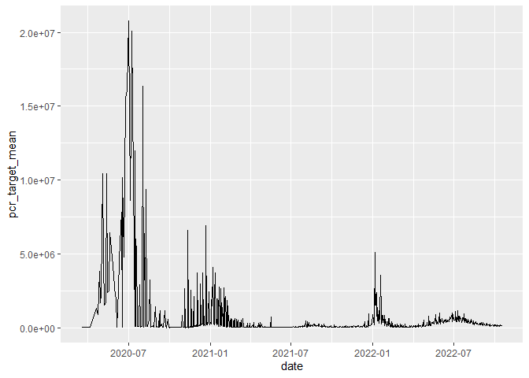
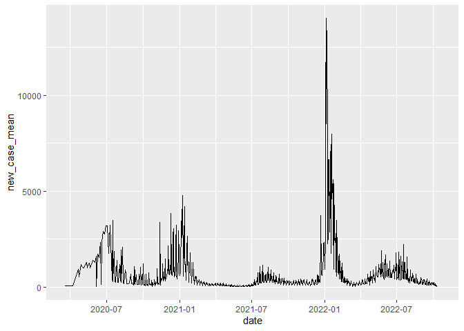

midterm project_appendix
================
chen wei
2022-10-23

## R Markdown

## Covid-19 new cases associated with the virus concentration in water other than air

# abstract

During this worldwide pandemic,most of the policy was based on
Coronavirus disease can be tranmitted by airbone. There were few
evidence shown that coronavirus disease lther tranmitted way, So in this
research is to explore whether it have association between the incidence
new cases and the concentration of virus in waste water include 19
counties of California. The result shows that the concentration and the
new cases shows a similar distribution in both demographical and date
dimension. But due to various reason, further explornary analysis is
needed.

# background

In late December 2019, people in Wuhan, China began to get sick with a
previously unknown pneumonia, marking the beginning of a new infectious
disease, later identified as a new type of coronavirus.Soon this
infectious disease became a worldwide pademic. The International
Committee on the Taxonomy of Viruses selected the name severe acute
respiratory syndrome coronavirus 2 (SARS-CoV-2) to represent that the
new virus is a sister of the original SARS virus. The disease the virus
causes was named coronavirus disease 2019 (COVID-19) by the World Health
Organization (WHO). The situation continues to change rapidly. multiple
policy such as 6 feet social distancing, facial masks, and quaratine are
all based on the SARS-CoV-2 can be transmitted by airbone. but there are
few research to see that if SARS-CoV-2 can be transmitted by water.
During the COVID-19 pandemic, it has been used for the detection and
quantification of SARS-CoV-2 virus shed into wastewater via feces of
infected persons. Wastewater surveillance tracks ““pooled samples”” that
reflect the overall disease activity for a community serviced by the
wastewater treatment plant (an area known as a ““sewershed”“), rather
than tracking samples from individual people. Collecting and analyzing
wastewater samples for the overall amount of SARS-CoV-2 viral particles
present can help inform public health about the level of viral
transmission within a community. Data from wastewater testing are not
intended to replace existing COVID-19 surveillance systems, but are
meant to complement them. While wastewater surveillance cannot determine
the exact number of infected persons in the area being monitored, it can
provide the overall trend of virus concentration within that community.
\# method \# wastewater collection Wastewater from communities is
collected by wastewater systems and transported to wastewater treatment
plants. Participating utilities collect samples of untreated wastewater
or primary sludge. These samples are sent to environmental laboratories
for SARS-CoV-2 testing. The testing data, along with the associated
utility metadata, are submitted to participating STLT health
departments. Health departments submit these data to CDC through the
online NWSS DCIPHER portal. CDC analyzes the data in real time and
reports results to the health department for use in their COVID-19
response. CDC also summarizes the national data on COVID Data Tracker.
SARS-CoV-2 RNA is quantified using PCR technology: reverse transcription
quantitative PCR (RT-qPCR), reverse transcription digital PCR (RT-dPCR),
or reverse transcription droplet digital PCR (RT-ddPCR). Laboratory
staff should convert concentration estimates produced by PCR software
(in units of copies per reaction or copies per reaction volume) to virus
concentrations per volume of unconcentrated wastewater or sludge sample.
This conversion accounts for the volume of template used in the PCR (and
reverse transcriptase reaction if separate), the concentration factor of
nucleic acid extraction, and sample concentration processes. the data
was download as .csv from the website
<https://data.ca.gov/dataset/covid-19-wastewater-surveillance-data-california>
\#California case The”Total Tests” and “Positive Tests” columns show
totals based on the collection date. There is a lag between when a
specimen is collected and when it is reported in this dataset. As a
result, the most recent dates on the table will temporarily show NONE in
the “Total Tests” and “Positive Tests” columns. This should not be
interpreted as no tests being conducted on these dates. Instead, these
values will be updated with the number of tests conducted as data is
received. When comparing to the state dashboard, the dashboard numbers
will correspond to the “Reported” columns in this table. Also note that
the dashboard displays data that is one day prior to today’s date.
<https://data.ca.gov/dataset/covid-19-time-series-metrics-by-county-and-state>
\# software using the dataset was downloaded as .csv form. Excel was
using for slightly adjusted few columns. Most of the data analyzing,
figure generating, and data wrangling was completed by R version 4.2.1
(2022-06-23 ucrt). \# statistic anlystic First download and then read in
with data.from the resource website seprately(code and output can be
seen on Appendix).The data reported the incidence case and cummulative
case include 59 county from california started from 2020-2-1, the last
updated is 2022-10-11. There are 60085 observation based on date,985
observation in each 59 county in the whole california, which is much
bigger than the data download from waterwaste website. The data
downloaded from the waterwaste website contains 12773 observation
started from 2021-1-1, last updated is2022-9-9 based on the data include
only 21 county. After an basic explornary analysis, 985 observation from
case data and 14 observation from waterwaste data was removed.

# result

for easier comparision and lining up, only shared the same county names
and date between 2 data set. After a couple filter and selection, only
15181 observation from case dataset was remained abd 12759 observation
from waterwaste was remained. Based on the uneven observation between
each counties and date, the mean of new cases(unit:people) and the
pcr_target concentration(unit:copied/L) grouped by each date and
counties. This would be the 12759 observations basic data which would be
analyzed in the county and date dimension . In this data started at
2020-3-19, last updated on 2022-10-18. include 19 big counti around
California, we can see that the new cases has a relatively positive
trend when the date increased, and the pcr concentration in the
waterwaste was also increased. (full data can be seen on appendix.) Then
the dataset was calculated grouped by county first. In Figure 1, the map
of California. Figure 1 shown a comparison distribution map of
pcr_concentration mean of the virus and the new cases coming out in thie
2 years dataset. In Figure 1, Tthe pcr concentration and new cases are
all shows a high number(lighther color) around Los Anglese area.

``` r
data_avg<-merge(
  # Data
  x     = data_avg1,      
  y     = data_avg2, 
  # List of variables to match
  by.x  = c("date", "county_names"),
  by.y  = c("date", "county_names"), 
  # Which obs to keep?
  all.x = FALSE,      
  all.y = TRUE
  ) 
data_avg
```

    ##              date county_names new_case_mean cumulative_mean pcr_target_mean
    ##     1: 2020-03-19  Santa Clara            51             847        10593.77
    ##     2: 2020-03-27  Santa Clara            45            1283        26221.44
    ##     3: 2020-04-07  Santa Clara            53            1759         6495.19
    ##     4: 2020-04-21  Los Angeles           915           21792      1299000.00
    ##     5: 2020-04-23  Los Angeles          1023           23676      1746000.00
    ##    ---                                                                      
    ## 12755: 2022-10-18    San Mateo            NA              NA       725800.50
    ## 12756: 2022-10-18  Santa Clara            NA              NA        58088.58
    ## 12757: 2022-10-18  Santa Clara            NA              NA        58088.58
    ## 12758: 2022-10-18  Santa Clara            NA              NA        58088.58
    ## 12759: 2022-10-18         Yolo            NA              NA        74598.28
    ##             lng    lat
    ##     1:       NA     NA
    ##     2:       NA     NA
    ##     3:       NA     NA
    ##     4: -118.286 33.801
    ##     5: -118.286 33.801
    ##    ---                
    ## 12755:       NA     NA
    ## 12756:       NA     NA
    ## 12757:       NA     NA
    ## 12758:       NA     NA
    ## 12759:       NA     NA

there are clear association between

    ##       county_names new_case_mean cumulative_mean
    ##  1:        Alameda    418.958698      150333.129
    ##  2:   Contra Costa    300.354193      113870.335
    ##  3:         Fresno    320.023780      143097.567
    ##  4:       Imperial     72.628285       36557.979
    ##  5:           Kern    249.598248      124611.005
    ##  6:           Lake     15.566959        6177.569
    ##  7:    Los Angeles   3885.132666     1662942.522
    ##  8:         Merced     84.050063       40009.834
    ##  9:         Orange    790.858573      342472.468
    ## 10:         Plumas      4.534418        1618.014
    ## 11:     Sacramento    416.131414      166984.196
    ## 12: San Bernardino    794.170213      369122.213
    ## 13:      San Diego   1116.764706      436429.718
    ## 14:  San Francisco    215.217772       72679.074
    ## 15:      San Mateo    202.888611       71956.831
    ## 16:    Santa Clara    523.345432      187439.534
    ## 17:     Stanislaus    160.052566       74939.708
    ## 18:        Ventura    251.080100      107033.703
    ## 19:           Yolo     56.919900       22202.253

    ##       county_names pcr_target_mean     lat       lon
    ##  1:         Plumas        424598.7 39.9927 -120.8039
    ##  2:           Kern        134521.8 35.4937 -118.8597
    ##  3:       Imperial         77033.9 33.0114 -115.4734
    ##  4:   Contra Costa        149388.8 37.8534 -121.9018
    ##  5:        Alameda        157411.6 37.6017 -121.7195
    ##  6:         Fresno        143446.1 36.7378 -119.7871
    ##  7:    Los Angeles       1122314.4 34.0522 -118.2437
    ##  8:           Lake        188735.2 39.0840 -122.8084
    ##  9:         Orange       1687528.4 33.7175 -117.8311
    ## 10: San Bernardino        112246.1 34.1083 -117.2898
    ## 11:      San Diego        144460.4 32.7157 -117.1611
    ## 12:  San Francisco        165949.4 37.7749 -122.4194
    ## 13:     Stanislaus        148351.3 37.5091 -120.9876
    ## 14:         Merced        192588.4 37.2010 -120.7120
    ## 15:      San Mateo        199520.0 37.4337 -122.4014
    ## 16:    Santa Clara        168387.7 37.3337 -121.8907
    ## 17:           Yolo        139822.0 38.7646 -121.9018
    ## 18:     Sacramento        170640.7 38.4747 -121.3542
    ## 19:        Ventura        917921.2 34.3705 -119.1391

``` r
county_avg<-merge(
  # Data
  x     = county_avg1,      
  y     = county_avg2, 
  # List of variables to match
  by.x  =  "county_names",
  by.y  =  "county_names", 
  # Which obs to keep?
  all.x = FALSE,      
  all.y = TRUE
  ) 
county_avg
```

    ##       county_names new_case_mean cumulative_mean pcr_target_mean     lat
    ##  1:        Alameda    418.958698      150333.129        157411.6 37.6017
    ##  2:   Contra Costa    300.354193      113870.335        149388.8 37.8534
    ##  3:         Fresno    320.023780      143097.567        143446.1 36.7378
    ##  4:       Imperial     72.628285       36557.979         77033.9 33.0114
    ##  5:           Kern    249.598248      124611.005        134521.8 35.4937
    ##  6:           Lake     15.566959        6177.569        188735.2 39.0840
    ##  7:    Los Angeles   3885.132666     1662942.522       1122314.4 34.0522
    ##  8:         Merced     84.050063       40009.834        192588.4 37.2010
    ##  9:         Orange    790.858573      342472.468       1687528.4 33.7175
    ## 10:         Plumas      4.534418        1618.014        424598.7 39.9927
    ## 11:     Sacramento    416.131414      166984.196        170640.7 38.4747
    ## 12: San Bernardino    794.170213      369122.213        112246.1 34.1083
    ## 13:      San Diego   1116.764706      436429.718        144460.4 32.7157
    ## 14:  San Francisco    215.217772       72679.074        165949.4 37.7749
    ## 15:      San Mateo    202.888611       71956.831        199520.0 37.4337
    ## 16:    Santa Clara    523.345432      187439.534        168387.7 37.3337
    ## 17:     Stanislaus    160.052566       74939.708        148351.3 37.5091
    ## 18:        Ventura    251.080100      107033.703        917921.2 34.3705
    ## 19:           Yolo     56.919900       22202.253        139822.0 38.7646
    ##           lon
    ##  1: -121.7195
    ##  2: -121.9018
    ##  3: -119.7871
    ##  4: -115.4734
    ##  5: -118.8597
    ##  6: -122.8084
    ##  7: -118.2437
    ##  8: -120.7120
    ##  9: -117.8311
    ## 10: -120.8039
    ## 11: -121.3542
    ## 12: -117.2898
    ## 13: -117.1611
    ## 14: -122.4194
    ## 15: -122.4014
    ## 16: -121.8907
    ## 17: -120.9876
    ## 18: -119.1391
    ## 19: -121.9018

    ## PhantomJS not found. You can install it with webshot::install_phantomjs(). If it is installed, please make sure the phantomjs executable can be found via the PATH variable.

<div id="htmlwidget-cff1d6bb130ca0099e08" style="width:672px;height:480px;" class="leaflet html-widget"></div>
<script type="application/json" data-for="htmlwidget-cff1d6bb130ca0099e08">{"x":{"options":{"crs":{"crsClass":"L.CRS.EPSG3857","code":null,"proj4def":null,"projectedBounds":null,"options":{}}},"calls":[{"method":"addProviderTiles","args":["CartoDB.Positron",null,null,{"errorTileUrl":"","noWrap":false,"detectRetina":false}]},{"method":"addCircles","args":[[37.6017,37.8534,36.7378,33.0114,35.4937,39.084,34.0522,37.201,33.7175,39.9927,38.4747,34.1083,32.7157,37.7749,37.4337,37.3337,37.5091,34.3705,38.7646],[-121.7195,-121.9018,-119.7871,-115.4734,-118.8597,-122.8084,-118.2437,-120.712,-117.8311,-120.8039,-121.3542,-117.2898,-117.1611,-122.4194,-122.4014,-121.8907,-120.9876,-119.1391,-121.9018],500,null,null,{"interactive":true,"className":"","stroke":true,"color":["#1B6801","#196701","#176701","#006400","#156701","#216901","#999013","#226901","#DAA520","#457304","#1D6801","#0E6600","#176701","#1C6801","#236901","#1D6801","#186701","#81880F","#166701"],"weight":5,"opacity":1,"fill":true,"fillColor":["#1B6801","#196701","#176701","#006400","#156701","#216901","#999013","#226901","#DAA520","#457304","#1D6801","#0E6600","#176701","#1C6801","#236901","#1D6801","#186701","#81880F","#166701"],"fillOpacity":1},null,null,["157411.65copies/L","149388.78copies/L","143446.08copies/L","77033.9copies/L","134521.83copies/L","188735.2copies/L","1122314.44copies/L","192588.4copies/L","1687528.39copies/L","424598.75copies/L","170640.68copies/L","112246.08copies/L","144460.43copies/L","165949.45copies/L","199519.98copies/L","168387.74copies/L","148351.32copies/L","917921.2copies/L","139822copies/L"],{"interactive":false,"permanent":false,"direction":"auto","opacity":1,"offset":[0,0],"textsize":"10px","textOnly":false,"className":"","sticky":true},null,null]},{"method":"addLegend","args":[{"colors":["#006400 , #236901 7.63530111935547%, #427204 20.0538471772664%, #5B7B07 32.4723932351773%, #73830C 44.8909392930883%, #8B8B10 57.3094853509992%, #A29315 69.7280314089101%, #B99A19 82.1465774668211%, #D0A21E 94.565123524732%, #DAA520 "],"labels":["200,000","400,000","600,000","800,000","1,000,000","1,200,000","1,400,000","1,600,000"],"na_color":null,"na_label":"NA","opacity":1,"position":"bottomleft","type":"numeric","title":"SARS-CoV-2 concentration, copies/L","extra":{"p_1":0.0763530111935547,"p_n":0.94565123524732},"layerId":null,"className":"info legend","group":null}]}],"limits":{"lat":[32.7157,39.9927],"lng":[-122.8084,-115.4734]}},"evals":[],"jsHooks":[]}</script>

    ## function (x) 
    ## {
    ##     if (length(x) == 0 || all(is.na(x))) {
    ##         return(pf(x))
    ##     }
    ##     if (is.null(rng)) 
    ##         rng <- range(x, na.rm = TRUE)
    ##     rescaled <- scales::rescale(x, from = rng)
    ##     if (any(rescaled < 0 | rescaled > 1, na.rm = TRUE)) 
    ##         warning("Some values were outside the color scale and will be treated as NA")
    ##     if (reverse) {
    ##         rescaled <- 1 - rescaled
    ##     }
    ##     pf(rescaled)
    ## }
    ## <bytecode: 0x0000014fc00042b8>
    ## <environment: 0x0000014fc11f9978>
    ## attr(,"colorType")
    ## [1] "numeric"
    ## attr(,"colorArgs")
    ## attr(,"colorArgs")$na.color
    ## [1] "#808080"

<div id="htmlwidget-63b05f7e2e88a45f1df9" style="width:672px;height:480px;" class="leaflet html-widget"></div>
<script type="application/json" data-for="htmlwidget-63b05f7e2e88a45f1df9">{"x":{"options":{"crs":{"crsClass":"L.CRS.EPSG3857","code":null,"proj4def":null,"projectedBounds":null,"options":{}}},"calls":[{"method":"addProviderTiles","args":["CartoDB.Positron",null,null,{"errorTileUrl":"","noWrap":false,"detectRetina":false}]},{"method":"addCircles","args":[[37.6017,37.8534,36.7378,33.0114,35.4937,39.084,34.0522,37.201,33.7175,39.9927,38.4747,34.1083,32.7157,37.7749,37.4337,37.3337,37.5091,34.3705,38.7646],[-121.7195,-121.9018,-119.7871,-115.4734,-118.8597,-122.8084,-118.2437,-120.712,-117.8311,-120.8039,-121.3542,-117.2898,-117.1611,-122.4194,-122.4014,-121.8907,-120.9876,-119.1391,-121.9018],500,null,null,{"interactive":true,"className":"","stroke":true,"color":["#2C6C02","#236901","#256A01","#0C6500","#1F6901","#026400","#DAA520","#0D6500","#437204","#006400","#2C6C02","#437204","#547806","#1C6801","#1B6801","#336E02","#176701","#1F6901","#096500"],"weight":5,"opacity":1,"fill":true,"fillColor":["#2C6C02","#236901","#256A01","#0C6500","#1F6901","#026400","#DAA520","#0D6500","#437204","#006400","#2C6C02","#437204","#547806","#1C6801","#1B6801","#336E02","#176701","#1F6901","#096500"],"fillOpacity":1},null,null,["418.96cases","300.35cases","320.02cases","72.63cases","249.6cases","15.57cases","3885.13cases","84.05cases","790.86cases","4.53cases","416.13cases","794.17cases","1116.76cases","215.22cases","202.89cases","523.35cases","160.05cases","251.08cases","56.92cases"],{"interactive":false,"permanent":false,"direction":"auto","opacity":1,"offset":[0,0],"textsize":"10px","textOnly":false,"className":"","sticky":true},null,null]},{"method":"addLegend","args":[{"colors":["#006400 , #316D02 12.7677628638089%, #4E7605 25.6523741549211%, #677F09 38.5369854460333%, #80870E 51.4215967371455%, #988F13 64.3062080282578%, #AF9718 77.19081931937%, #C79F1C 90.0754306104822%, #DAA520 "],"labels":["500","1,000","1,500","2,000","2,500","3,000","3,500"],"na_color":null,"na_label":"NA","opacity":1,"position":"bottomleft","type":"numeric","title":"new Covid-19 cases, observation","extra":{"p_1":0.127677628638089,"p_n":0.900754306104822},"layerId":null,"className":"info legend","group":null}]}],"limits":{"lat":[32.7157,39.9927],"lng":[-122.8084,-115.4734]}},"evals":[],"jsHooks":[]}</script>

From the Figure one we can see that the there is a similar distribution
between the virus concentration and the incidence case. \#Figure2.line
plot of virus concentration VS. cases

``` r
date_avg1<-
    data_avg[ , .(
    new_case_mean      =mean(new_case_mean, na.rm=T),
    cumulative_mean       =mean(cumulative_mean, na.rm=T))
  ,by = 'date']
  date_avg1
```

    ##            date new_case_mean cumulative_mean
    ##   1: 2020-03-19          51.0             847
    ##   2: 2020-03-27          45.0            1283
    ##   3: 2020-04-07          53.0            1759
    ##   4: 2020-04-21         915.0           21792
    ##   5: 2020-04-23         519.5           13062
    ##  ---                                         
    ## 802: 2022-10-14           NaN             NaN
    ## 803: 2022-10-15           NaN             NaN
    ## 804: 2022-10-16           NaN             NaN
    ## 805: 2022-10-17           NaN             NaN
    ## 806: 2022-10-18           NaN             NaN

``` r
date_avg2<-
    data_avg[ , .(
    pcr_target_mean      =mean(pcr_target_mean, na.rm=T)
    )
  ,by ='date']
date_avg2
```

    ##            date pcr_target_mean
    ##   1: 2020-03-19        10593.77
    ##   2: 2020-03-27        26221.44
    ##   3: 2020-04-07         6495.19
    ##   4: 2020-04-21      1299000.00
    ##   5: 2020-04-23       876110.27
    ##  ---                           
    ## 802: 2022-10-14       151457.70
    ## 803: 2022-10-15       117168.21
    ## 804: 2022-10-16       113918.44
    ## 805: 2022-10-17       121294.02
    ## 806: 2022-10-18       175543.20

``` r
date_avg<-merge(
  # Data
  x     = date_avg1,      
  y     = date_avg2, 
  # List of variables to match
  by.x  = "date",
  by.y  = "date", 
  # Which obs to keep?
  all.x = FALSE,      
  all.y = TRUE
  ) 
date_avg
```

    ##            date new_case_mean cumulative_mean pcr_target_mean
    ##   1: 2020-03-19          51.0             847        10593.77
    ##   2: 2020-03-27          45.0            1283        26221.44
    ##   3: 2020-04-07          53.0            1759         6495.19
    ##   4: 2020-04-21         915.0           21792      1299000.00
    ##   5: 2020-04-23         519.5           13062       876110.27
    ##  ---                                                         
    ## 802: 2022-10-14           NaN             NaN       151457.70
    ## 803: 2022-10-15           NaN             NaN       117168.21
    ## 804: 2022-10-16           NaN             NaN       113918.44
    ## 805: 2022-10-17           NaN             NaN       121294.02
    ## 806: 2022-10-18           NaN             NaN       175543.20

``` r
ggplot(data = date_avg)+
 geom_line(mapping=aes(x=date, y=pcr_target_mean))
```

<!-- -->

``` r
ggplot(data = date_avg)+
 geom_line(mapping=aes(x=date, y=new_case_mean))
```

    ## Warning: Removed 7 row(s) containing missing values (geom_path).

<!-- -->
Figure 2 shows a group of lineplot of time series vs pcr_concentration
and new cases. We can see that there is all have a peak on July, 2020 in
both variable, and a peak on the Janurary 2022. based on this two
dimension, there is an similar association between pcr concentration and
also the mean.

# discussion

even though there has a relatively obvious shared association between
this 2 viriable. But there is still limitations. eventhough the
concentration of virus in the wastewater are a realtively strong
evidence, but there based on the water survilence resource shown that
there is still limitation on detection and quantification for using it
as a dataset. It is not possible to reliably and accurately predict the
total number of infected individals in a community based on sewage
surveillance alone.Wastewater surveillance will not represent homes on
septic-based systems.Community-level wastewater surveillance at a
wastewater treatment plant will not represent communities or facilities
served by decentralized systems, such as prisons, universities, or
hospitals that treat their own waste.Low levels of infection in a
community may not be captured by sewage surveillance if the quantity of
SARS-CoV-2 falls below the limit of detection for lab analysis. except
for the data itself, the limit area of dataset also affect the
accurately.There is only 19 counties and 2 years of unconescutive data,
which is limited and easily influenced by other factors. \# conclusion
based on the Figure shown above, there is a similar association between
the pcr-concentration from wastewater and also the new daily cases.
pcr-concentration from wastewater may can be used as a predictor of
covid_19 but still further research is needed.

# resource

1.  <https://data.ca.gov/dataset/covid-19-wastewater-surveillance-data-california>
2.  <https://data.ca.gov/dataset/covid-19-time-series-metrics-by-county-and-state>
3.  <https://transition.fcc.gov/oet/info/maps/census/fips/fips.txt>
4.  <https://www.latlong.net/country/united-states-236.html>
5.  <https://www.cdph.ca.gov/Programs/CID/DCDC/Pages/COVID-19/Wastewater-Surveillance.aspx>

Note that the `echo = FALSE` parameter was added to the code chunk to
prevent printing of the R code that generated the plot.
